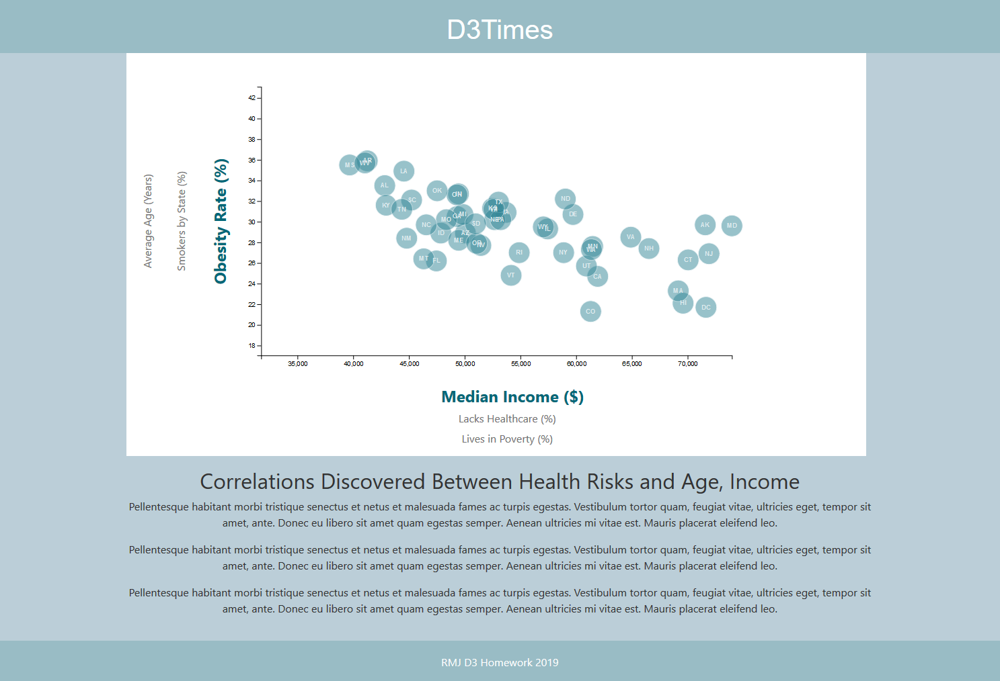
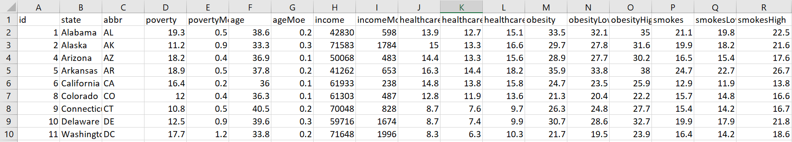
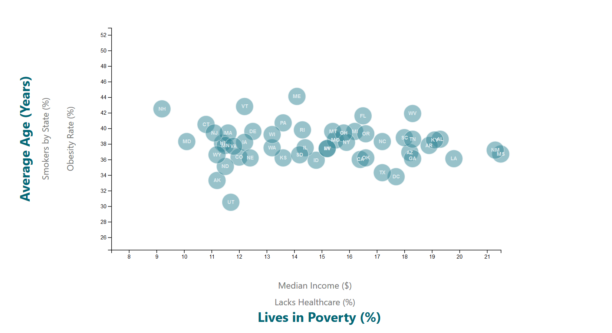
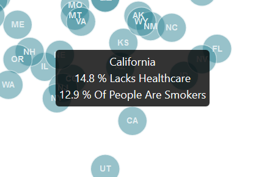

#Data Journalism and D3

## D3 Interactive Scatter Plot



--------------------------------------

## Census Data

The editor wants to run a series of feature stories about the health risks facing particular demographics. She's counting on me to sniff out the first story idea by sifting through information from the U.S. Census Bureau and the Behavioral Risk Factor Surveillance System.



--------------------------------------

## My Task

* Create a scatter plot between two of the data variables such as Income vs. Obesity or Smokers vs. Healthcare


* Create a scatter plot that represents each state with circle elements. Pull in the data from data.csv by using the d3.csv function.

* Include state abbreviations in the circles.

* Create and situate your axes and labels to the left and bottom of the chart.

### Bind the scatter circles and text within the circles

```javascript
// Create an SVG wrapper, append an SVG group that will hold our chart,
// and shift the latter by left and top margins.
var svg = d3
  .select("#scatter")
  .append("svg")
  .attr("width", svgWidth)
  .attr("height", svgHeight)
  .classed("chart", true);

// Append an SVG group
var chartGroup = svg.append("g")
  .attr("transform", `translate(${margin.left}, ${margin.top})`);

// Initial Params
var chosenXAxis = "income";
var chosenYAxis = "obesity";


// function used for updating x-scale var upon click on axis label
function xScale(stateData, chosenXAxis) {
  // create scales
  var xLinearScale = d3.scaleLinear()
    .domain([d3.min(stateData, d => d[chosenXAxis]) * 0.8,
      d3.max(stateData, d => d[chosenXAxis])])
    .range([0, width]);

  return xLinearScale;
}

// function used for updating y-scale var upon click on axis label
function yScale(stateData, chosenYAxis) {
  // create scales
  var yLinearScale = d3.scaleLinear()
    .domain([d3.min(stateData, d => d[chosenYAxis]) * 0.8,
      d3.max(stateData, d => d[chosenYAxis]) * 1.2])
    .range([height, 0]);

  return yLinearScale;
}
```




--------------------------------------------

## Retrieve the data to create the plot

```javascript
// Retrieve data from the CSV file and execute everything below
d3.csv("assets/data/data.csv", function(err, stateData) {
    console.log(stateData);
  if (err) throw err;

  // parse data
  stateData.forEach(function(data) {
    data.poverty = +data.poverty;
    data.age = +data.age;
    data.income = +data.income;
    data.healthcare = +data.healthcare;
    data.obesity = +data.obesity;
    data.smokes = +data.smokes;
    data.abbr = data.abbr;

  });

  // xLinearScale function above csv import
  var xLinearScale = xScale(stateData, chosenXAxis);
  var yLinearScale = yScale(stateData, chosenYAxis);


  // Create initial axis functions
  var bottomAxis = d3.axisBottom(xLinearScale);
  var leftAxis = d3.axisLeft(yLinearScale);

  // append x axis
  var xAxis = chartGroup.append("g")
    .classed("x-axis", true)
    .attr("transform", `translate(0, ${height})`)
    .call(bottomAxis);

  // append y axis
  var yAxis = chartGroup.append("g")
    .classed("y-axis", true)
    .call(leftAxis);


  // append initial circles
  var circlesGroup = chartGroup.selectAll("circle")
    .data(stateData)
    .enter()
    .append("circle")
    .classed("stateCircle", true)
    .attr("cx", d => xLinearScale(d[chosenXAxis]))
    .attr("cy", d => yLinearScale(d[chosenYAxis]))
    .attr("r", 16)
    .attr("opacity", ".5");


    // Add state abbreviation withon scatter circle
    var circleState = chartGroup.selectAll("stateText")
    .data(stateData)
    .enter()
    .append("text")
    .classed("stateText", true)
    .attr("x", d => xLinearScale(d[chosenXAxis]))
    .attr("y", d => yLinearScale(d[chosenYAxis]))    
    .text(function(d) { return d.abbr})
    .attr("dy", 3)
    .attr("font-size", 9)
    .attr("font-weight", "bold")
    .attr("text-anchor","middle");
```
------------------------------------------------------

## Incorporate d3-tip

```javascript
// function used for updating circles group with new tooltip
function updateToolTip(chosenXAxis, chosenYAxis, circlesGroup) {

  //X axis if conditions  
  if (chosenXAxis === "income") {
    var Xlabel = "Dollars is the Median Income";
  }
  else if (chosenXAxis === "healthcare") {
    var Xlabel = "% Lacks Healthcare";
  }

  else {
    var Xlabel = "% Lives in Poverty";
  }

  //Y axis if conditions  
  if (chosenYAxis === "obesity") {
    var Ylabel = "% Obesity Rate";
  }
  else if (chosenYAxis === "smokes") {
    var Ylabel = "% of People are Smokers";
  }

  else {
    var Ylabel = "is the Average Age";
  }
  
  // D3 tool tip mouseover fuction
  var toolTip = d3.tip()
    .attr("class", "d3-tip")
    .offset([0, 0])
    .html(function(d) {
      return (`${d.state}<br> ${d[chosenXAxis]} ${Xlabel}<br> 
      ${d[chosenYAxis]} ${Ylabel}`);
    });

  circlesGroup.call(toolTip);

  circlesGroup.on("mouseover", function(data) {
    toolTip.show(data);
  })
    // onmouseout event
    .on("mouseout", function(data, index) {
      toolTip.hide(data);
    });

  return circlesGroup;
}
```

